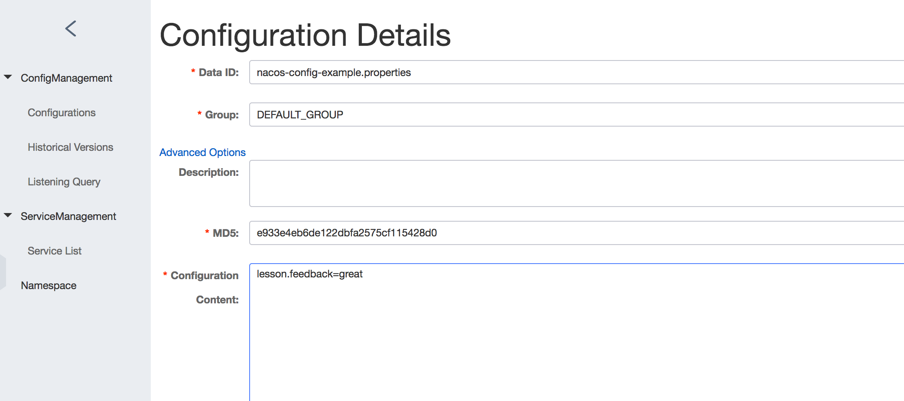

# Nacos-config-demo

## Introduction
Microservice, by design, should be stateless. What if we have certain configuration that has to be provided for the microservice to run? For example, a security token to access another service. Or, the url of the database to connect to. These information also changes with the deployment environment. Hence, a centralized server is critical in the architecture.    
Nacos is a config server that serves micro services architecture. In this demo, we'll use a Spring Cloud application to access the config.

## Pre-requisite

We need a Nacos server to run locally for the demo to work. Here are the steps:
```
git clone https://github.com/alibaba/nacos.git
cd nacos/
mvn -Prelease-nacos clean install -U  
ls -al distribution/target/

// change the $version to your actual path
cd distribution/target/nacos-server-$version/nacos/bin

sh startup.sh -m standalone
```
Replace the `$version` with the real version number.

## Prep work

Once Nacos server is running, we should be able to access its dashbord at:
`http://localhost:8848/nacos/index.html`.       
The login/password is `nacos/nacos`.   
Once logging, let's click on the `+` sign on the right side of the config table. At this point, we want to add a config:

